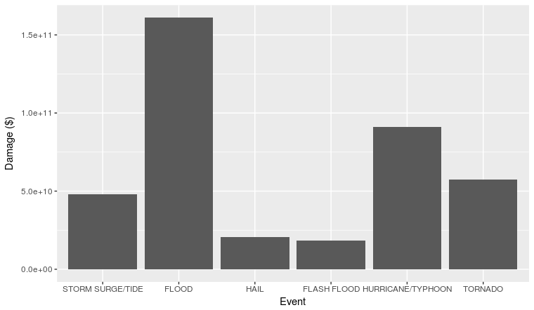
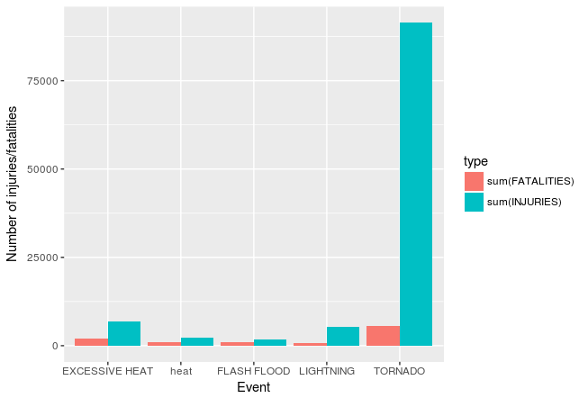

```{r setup, include=FALSE}
knitr::opts_chunk$set(echo = TRUE)
```
## Synopsis

This is an analysis of data collected about storms that afflicted the US soil from 1950 till November 2011. The objective is to find out the storm types that have had the greatest economic impact, as well as the most harmful to the population in terms of health. In economic impact, Floods seem to have caused the most damage by far, causing losses of approximately 161 billion dollars, followed by Hurricanes, at 90 billion, as shown in figure 1. In terms of health, tornadoes seem to have caused the most injuries, at 91407 people injured, and also the most fatalities, at 5636. The effects of tornadoes have by far been the worst as we can see in figure 2.

### Figure 1:


###Figure 2:



## Data Processing

```{r cache=TRUE}
rawData <- read.csv('repdata_data_StormData.csv.bz2')
```

### Data cleaning

Since there are many events that are recorded differently in the in the 'EVTYPE' variable, including some misspelled ones, while the documentation only cites 48 different event types, and there seem to be some events in the dataset which seem distinct from the 48, I will first look for different events that can be grouped into one event type. We also have to be cognizant of events like 'Coastal Flood', 'Flash Flood', and 'Flood', which are distinct events according to the documentation. Agrepping all the events in section 2.1.1 'Storm Data Event Table' and others that I could find to find out which can be identified with exact matches, and which need to be grouped under which category.


```{r}
events2look4 <- list('tide', 'avalanche', 'black ice', 'blizzard', 'coastal flood', 'fire', 'cold wind chill', 'debris flow', 'dense fog', 'dense smoke', 'drought', 'dust devil', 'dust storm', 'excessive heat', 'extreme cold wind chill', 'flash flood', 'flood', 'frost/freeze', 'funnel cloud', 'freezing fog', 'hail', 'heat', 'heavy rain', 'heavy snow', 'high surf', 'high wind', 'hurricane', 'ice storm', 'lake-effect snow', 'lakeshore flood', 'lightning', 'marine hail', 'marine high wind', 'marine strong wind', 'marine thunderstorm wind', 'rip current', 'seiche', 'sleet', 'storm surge/tide', 'strong wind', 'thunderstorm wind', 'tornado', 'tropical depression', 'tropical storm', 'tsunami', 'volcanic ash', 'waterspout', 'wildfire', 'winter storm', 'winter weather')
names(events2look4) <- as.vector(events2look4)
lapply(events2look4, function(x) {agrep(x, levels(rawData$EVTYPE), ignore.case = T, value = T)})
```

- Seems logical to group 'AVALANCE' and 'AVALANCHE', but the third one should go under 'HEAVY SNOW'
- inlude 'beach flood' and 'erosion' in 'COASTAL FLOOD'
- In 'excessive heat' results with 'drought' in them would be classified under 'drought'.
- in 'EXTREME COLD/WIND CHILL' exclude entries with 'blizzard'
- exclude from 'FLASH FLOOD' entries with 'ice storm', 'thunderstorm' and 'heavy rain' as they are apparently the cause of the flash flood, so they should be classified in their own headings
- exclude 'coastal flood', 'flash flood', 'heavy rain', 'heavy snow', 'lake flood', 'remnants of floyd', 'thunderstorm wind' from 'FLOOD'
- have to exclude from 'THUNDERSTORM WIND' entries that have 'funnel cloud'
- exlude from 'HAIL' 'bitter wind chill', 'blowing snow', 'extreme wind chill', 'wind chill', and 'cold wind chill'
- exclude from 'HIGH WIND', 'flood', and 'flash flood'. in 'HEAVY RAIN' include 'heavy shower'
- exclude from 'HEAVY SNOW' 'heavy shower', 'blizzard'
- exclude 'blizzard', 'heavy snow', 'hurricane', 'marine high wind', 'record cold' from 'HIGH WIND' results
- exclude from 'ICE STORM' 'blizzard'
- exclude 'heavy rain', 'thunderstorm wind', 'tstm' from 'LIGHTNING' results
- exclude from 'HIGH WIND' 'marine high wind'
- exclude 'heavy snow', 'flood', 'thunderstorm wind', 'marine strong wind' from 'STRONG WIND'
exclude 'marine thunderstorm wind' from 'THUNDERSTORM WIND'
exclude 'dust devil', 'tornado' from 'WATERSPOUT'
exclude 'blizzard', 'heavy snow' from 'WINTER STORM'


Reassigning levels in test dataframe with original and new levels as separate columns to compare results. If satisfactory, will replace levels of EVTYPES in original dataframe with the new levels


```{r message=FALSE}
if (!require(tidyverse)) install.packages("tidyverse")
library(tidyverse)
testLevelsFrame <- data.frame(original_levels=rawData$EVTYPE)
testLevelsFrame$newlevels <- rawData$EVTYPE

levels(testLevelsFrame$newlevels)[grep('astronomical low', levels(testLevelsFrame$newlevels), ignore.case = T)] <- 'ASTRONOMICAL LOW TIDE'
levels(testLevelsFrame$newlevels)[setdiff(agrep('avalanche', levels(testLevelsFrame$newlevels), ignore.case = T), agrep('heavy snow', levels(testLevelsFrame$newlevels), ignore.case = T))] <- 'AVALANCHE'
levels(testLevelsFrame$newlevels)[agrep('black ice', levels(testLevelsFrame$newlevels), ignore.case = T)] <- 'BLACK ICE'
levels(testLevelsFrame$newlevels)[agrep('blizzard', levels(testLevelsFrame$newlevels), ignore.case = T)] <- 'BLIZZARD'
levels(testLevelsFrame$newlevels)[grep('fire', levels(testLevelsFrame$newlevels), ignore.case = T)] <- 'FIRE'
levels(testLevelsFrame$newlevels)[unique(c(agrep('coastal flood', levels(testLevelsFrame$newlevels), ignore.case = T), agrep('erosion', levels(testLevelsFrame$newlevels), ignore.case = T), agrep('beach flood', levels(testLevelsFrame$newlevels), ignore.case = T), agrep('coastal flooding', levels(testLevelsFrame$newlevels), ignore.case = T)))] <- 'COASTAL FLOOD'
levels(testLevelsFrame$newlevels)[agrep('coastal storm', levels(testLevelsFrame$newlevels), ignore.case = T)] <- 'COASTAL STORM'
levels(testLevelsFrame$newlevels)[setdiff(unique(c(agrep('cold wave', levels(testLevelsFrame$newlevels), ignore.case = T), agrep('excessive cold', levels(testLevelsFrame$newlevels), ignore.case = T), agrep('bitter wind chill', levels(testLevelsFrame$newlevels), ignore.case = T), agrep('wind chill', levels(testLevelsFrame$newlevels), ignore.case = T), agrep('cold temperature', levels(testLevelsFrame$newlevels), ignore.case = T), agrep('cold', levels(testLevelsFrame$newlevels), ignore.case = T), grep('cool', levels(testLevelsFrame$newlevels), ignore.case = T))), unique(c(grep('blizzard', levels(testLevelsFrame$newlevels), ignore.case = T), grep('extreme cold', levels(testLevelsFrame$newlevels), ignore.case = T), grep('dry conditions', levels(testLevelsFrame$newlevels), ignore.case = T), grep('record snow', levels(testLevelsFrame$newlevels), ignore.case = T), grep('record heat', levels(testLevelsFrame$newlevels), ignore.case = T), grep('record high', levels(testLevelsFrame$newlevels), ignore.case = T), grep('record precipitation', levels(testLevelsFrame$newlevels), ignore.case = T), grep('record temperature', levels(testLevelsFrame$newlevels), ignore.case = T), grep('record warm', levels(testLevelsFrame$newlevels), ignore.case = T), grep('snowfall', levels(testLevelsFrame$newlevels), ignore.case = T), grep('extreme', levels(testLevelsFrame$newlevels), ignore.case = T))))] <- 'COLD/WIND CHILL'
levels(testLevelsFrame$newlevels)[agrep('dense fog', levels(testLevelsFrame$newlevels), ignore.case = T)] <- 'DENSE FOG'
levels(testLevelsFrame$newlevels)[agrep('dense smoke', levels(testLevelsFrame$newlevels), ignore.case = T)] <- 'DENSE SMOKE'
levels(testLevelsFrame$newlevels)[agrep('drought', levels(testLevelsFrame$newlevels), ignore.case = T)] <- 'DROUGHT'
levels(testLevelsFrame$newlevels)[agrep('dry', levels(testLevelsFrame$newlevels), ignore.case = T)] <- 'DRY WEATHER'
levels(testLevelsFrame$newlevels)[unique(c(agrep('dust devil', levels(testLevelsFrame$newlevels), ignore.case = T), agrep('blowing dust', levels(testLevelsFrame$newlevels), ignore.case = T)))] <- 'DUST DEVIL'
levels(testLevelsFrame$newlevels)[agrep('dust storm', levels(testLevelsFrame$newlevels), ignore.case = T)] <- 'DUST STORM'
levels(testLevelsFrame$newlevels)[setdiff(unique(c(agrep('excessive heat', levels(testLevelsFrame$newlevels), ignore.case = T), agrep('heat wave', levels(testLevelsFrame$newlevels), ignore.case = T), grep('hot', levels(testLevelsFrame$newlevels), ignore.case = T))), agrep('drought', levels(testLevelsFrame$newlevels), ignore.case = T))] <- 'EXCESSIVE HEAT'
levels(testLevelsFrame$newlevels)[setdiff(unique(c(agrep('extreme cold wind chill', levels(testLevelsFrame$newlevels), ignore.case = T), grep('freezing', levels(testLevelsFrame$newlevels), ignore.case = T), agrep('blowing snow', levels(testLevelsFrame$newlevels), ignore.case = T), agrep('extreme wind chill', levels(testLevelsFrame$newlevels), ignore.case = T), agrep('record cold', levels(testLevelsFrame$newlevels), ignore.case = T), agrep('extreme cold', levels(testLevelsFrame$newlevels), ignore.case = T))), agrep('blizzard', levels(testLevelsFrame$newlevels), ignore.case = T))] <- 'EXTREME COLD/WIND CHILL'
levels(testLevelsFrame$newlevels)[setdiff(agrep('flash flood', levels(testLevelsFrame$newlevels), ignore.case = T), unique(c(agrep('ice storm', levels(testLevelsFrame$newlevels), ignore.case = T), agrep('thunderstorm', levels(testLevelsFrame$newlevels), ignore.case = T), agrep('heavy rain', levels(testLevelsFrame$newlevels), ignore.case = T))))] <- 'FLASH FLOOD'
levels(testLevelsFrame$newlevels)[setdiff(agrep('flood', levels(testLevelsFrame$newlevels), ignore.case = T), unique(c(agrep('coastal flood', levels(testLevelsFrame$newlevels), ignore.case = T), agrep('flash flood', levels(testLevelsFrame$newlevels), ignore.case = T), agrep('heavy rain', levels(testLevelsFrame$newlevels), ignore.case = T), agrep('heavy snow', levels(testLevelsFrame$newlevels), ignore.case = T), agrep('lake flood', levels(testLevelsFrame$newlevels), ignore.case = T), agrep('remnants of floyd', levels(testLevelsFrame$newlevels), ignore.case = T), agrep('thunderstorm wind', levels(testLevelsFrame$newlevels), ignore.case = T))))] <- 'FLOOD'
levels(testLevelsFrame$newlevels)[unique(c(agrep('frost freeze', levels(testLevelsFrame$newlevels), ignore.case = T), grep('frost', levels(testLevelsFrame$newlevels), ignore.case = T), grep('freeze', levels(testLevelsFrame$newlevels), ignore.case = T)))] <- 'FROST FREEZE'
levels(testLevelsFrame$newlevels)[setdiff(unique(c(agrep('funnel cloud', levels(testLevelsFrame$newlevels), ignore.case = T), grep('funnel', levels(testLevelsFrame$newlevels), ignore.case = T))), agrep('thunderstorm wind', levels(testLevelsFrame$newlevels), ignore.case = T))] <- 'FUNNEL CLOUD'
levels(testLevelsFrame$newlevels)[agrep('freezing fog', levels(testLevelsFrame$newlevels), ignore.case = T)] <- 'FREEZING FOG'
levels(testLevelsFrame$newlevels)[grep('gusty wind', levels(testLevelsFrame$newlevels), ignore.case = T)] <- 'GUSTY WIND'
levels(testLevelsFrame$newlevels)[setdiff(agrep('hail', levels(testLevelsFrame$newlevels), ignore.case = T), unique(c(agrep('bitter wind chill', levels(testLevelsFrame$newlevels), ignore.case = T), agrep('blowing snow', levels(testLevelsFrame$newlevels), ignore.case = T), agrep('extreme wind chill', levels(testLevelsFrame$newlevels), ignore.case = T), agrep('wind chill', levels(testLevelsFrame$newlevels), ignore.case = T), agrep('cold wind chill', levels(testLevelsFrame$newlevels), ignore.case = T))))] <- 'HAIL'
levels(testLevelsFrame$newlevels)[setdiff(grep('heat', levels(testLevelsFrame$newlevels), ignore.case = T), agrep('excessive heat', levels(testLevelsFrame$newlevels), ignore.case = T))] <- 'heat'
levels(testLevelsFrame$newlevels)[unique(c(agrep('heavy rain', levels(testLevelsFrame$newlevels), ignore.case = T), grep('excessive rain', levels(testLevelsFrame$newlevels), ignore.case = T), agrep('heavy shower', levels(testLevelsFrame$newlevels), ignore.case = T), grep('precipitation', levels(testLevelsFrame$newlevels), ignore.case = T)))] <- 'HEAVY RAIN'
levels(testLevelsFrame$newlevels)[setdiff(unique(c(agrep('heavy snow', levels(testLevelsFrame$newlevels), ignore.case = T), agrep('excessive snow', levels(testLevelsFrame$newlevels), ignore.case = T), agrep('record snow', levels(testLevelsFrame$newlevels), ignore.case = T), agrep('record winter snow', levels(testLevelsFrame$newlevels), ignore.case = T))), unique(c(agrep('heavy shower', levels(testLevelsFrame$newlevels), ignore.case = T), agrep('blizzard', levels(testLevelsFrame$newlevels), ignore.case = T), agrep('record low', levels(testLevelsFrame$newlevels), ignore.case = T))))] <- 'HEAVY SNOW'
levels(testLevelsFrame$newlevels)[unique(c(grep('surf', levels(testLevelsFrame$newlevels), ignore.case = T), grep('swell', levels(testLevelsFrame$newlevels), ignore.case = T)))] <- 'HIGH SURF'
levels(testLevelsFrame$newlevels)[setdiff(agrep('high wind', levels(testLevelsFrame$newlevels), ignore.case = T), unique(c(agrep('blizzard', levels(testLevelsFrame$newlevels), ignore.case = T), agrep('heavy snow', levels(testLevelsFrame$newlevels), ignore.case = T), agrep('hurricane', levels(testLevelsFrame$newlevels), ignore.case = T), agrep('marine high wind', levels(testLevelsFrame$newlevels), ignore.case = T), agrep('record cold', levels(testLevelsFrame$newlevels), ignore.case = T))))] <- 'HIGH WIND'
levels(testLevelsFrame$newlevels)[unique(c(agrep('hurricane', levels(testLevelsFrame$newlevels), ignore.case = T), agrep('typhoon', levels(testLevelsFrame$newlevels), ignore.case = T)))] <- 'HURRICANE/TYPHOON'
levels(testLevelsFrame$newlevels)[setdiff(agrep('ice storm', levels(testLevelsFrame$newlevels), ignore.case = T), agrep('blizzard', levels(testLevelsFrame$newlevels), ignore.case = T))] <- 'ICE STORM'
levels(testLevelsFrame$newlevels)[agrep('lake effect snow', levels(testLevelsFrame$newlevels), ignore.case = T)] <- 'LAKE EFFECT SNOW'
levels(testLevelsFrame$newlevels)[agrep('lakeshore flood', levels(testLevelsFrame$newlevels), ignore.case = T)] <- 'LAKESHORE FLOOD'
levels(testLevelsFrame$newlevels)[unique(c(agrep('landsl', levels(testLevelsFrame$newlevels), ignore.case = T), agrep('slide', levels(testLevelsFrame$newlevels), ignore.case = T)))] <- 'LANDSLIDE'
levels(testLevelsFrame$newlevels)[setdiff(agrep('lightning', levels(testLevelsFrame$newlevels), ignore.case = T), unique(c(agrep('heavy rain', levels(testLevelsFrame$newlevels), ignore.case = T), agrep('thunderstorm wind', levels(testLevelsFrame$newlevels), ignore.case = T), agrep('tstm', levels(testLevelsFrame$newlevels), ignore.case = T))))] <- 'LIGHTNING'
levels(testLevelsFrame$newlevels)[setdiff(agrep('marine hail', levels(testLevelsFrame$newlevels), ignore.case = T), agrep('marine high wind', levels(testLevelsFrame$newlevels), ignore.case = T))] <- 'MARINE HAIL'
levels(testLevelsFrame$newlevels)[agrep('marine strong wind', levels(testLevelsFrame$newlevels), ignore.case = T)] <- 'MARINE STRONG WIND'
levels(testLevelsFrame$newlevels)[agrep('marine high wind', levels(testLevelsFrame$newlevels), ignore.case = T)] <- 'MARINE HIGH WIND'
levels(testLevelsFrame$newlevels)[agrep('marine thunderstorm wind', levels(testLevelsFrame$newlevels), ignore.case = T)] <- 'MARINE THUNDERSTORM WIND'
levels(testLevelsFrame$newlevels)[agrep('rip current', levels(testLevelsFrame$newlevels), ignore.case = T)] <- 'RIP CURRENT'
levels(testLevelsFrame$newlevels)[agrep('seiche', levels(testLevelsFrame$newlevels), ignore.case = T)] <- 'SEICHE'
levels(testLevelsFrame$newlevels)[setdiff(agrep('sleet', levels(testLevelsFrame$newlevels), ignore.case = T), agrep('heavy snow', levels(testLevelsFrame$newlevels), ignore.case = T))] <- 'SLEET'
levels(testLevelsFrame$newlevels)[setdiff(unique(c(grep('storm surge', levels(testLevelsFrame$newlevels), ignore.case = T), grep('tide', levels(testLevelsFrame$newlevels), ignore.case = T))), grep('astronomical low', levels(testLevelsFrame$newlevels), ignore.case = T))] <- 'STORM SURGE/TIDE'
levels(testLevelsFrame$newlevels)[setdiff(agrep('strong wind', levels(testLevelsFrame$newlevels), ignore.case = T), unique(c(agrep('heavy snow', levels(testLevelsFrame$newlevels), ignore.case = T), agrep('flood', levels(testLevelsFrame$newlevels), ignore.case = T), agrep('thunderstorm wind', levels(testLevelsFrame$newlevels), ignore.case = T), agrep('marine strong wind', levels(testLevelsFrame$newlevels), ignore.case = T))))] <- 'STRONG WIND'
levels(testLevelsFrame$newlevels)[setdiff(agrep('thunderstorm wind', levels(testLevelsFrame$newlevels), ignore.case = T), agrep('marine thunderstorm wind', levels(testLevelsFrame$newlevels), ignore.case = T))] <- 'THUNDERSTORM WIND'
levels(testLevelsFrame$newlevels)[agrep('tornado', levels(testLevelsFrame$newlevels), ignore.case = T)] <- 'TORNADO'
levels(testLevelsFrame$newlevels)[agrep('tropical depression', levels(testLevelsFrame$newlevels), ignore.case = T)] <- 'TROPICAL DEPRESSION'
levels(testLevelsFrame$newlevels)[agrep('tropical storm', levels(testLevelsFrame$newlevels), ignore.case = T)] <- 'TROPICAL STORM'
levels(testLevelsFrame$newlevels)[agrep('tsunami', levels(testLevelsFrame$newlevels), ignore.case = T)] <- 'TSUNAMI'
levels(testLevelsFrame$newlevels)[agrep('volcanic ash', levels(testLevelsFrame$newlevels), ignore.case = T)] <- 'VOLCANIC ASH'
levels(testLevelsFrame$newlevels)[setdiff(agrep('waterspout', levels(testLevelsFrame$newlevels), ignore.case = T), unique(c(agrep('dust devil', levels(testLevelsFrame$newlevels), ignore.case = T), agrep('tornado', levels(testLevelsFrame$newlevels), ignore.case = T))))] <- 'WATERSPOUT'
levels(testLevelsFrame$newlevels)[agrep('wildfire', levels(testLevelsFrame$newlevels), ignore.case = T)] <- 'WILDFIRE'
levels(testLevelsFrame$newlevels)[setdiff(agrep('winter storm', levels(testLevelsFrame$newlevels), ignore.case = T), unique(c(agrep('blizzard', levels(testLevelsFrame$newlevels), ignore.case = T), agrep('heavy snow', levels(testLevelsFrame$newlevels), ignore.case = T))))] <- 'WINTER STORM'
levels(testLevelsFrame$newlevels)[unique(c(agrep('winter weather', levels(testLevelsFrame$newlevels), ignore.case = T), agrep('cold weather', levels(testLevelsFrame$newlevels), ignore.case = T)))] <- 'WINTER WEATHER'
rawData$EVTYPE <- testLevelsFrame$newlevels
```
Now to adjust PROPDMG and CROPDMG variables to be consistent for comparison

```{r}
exponents <- rep(1, 902297)
exponents[rawData$PROPDMGEXP %in% c('h', 'H')] <- 100
exponents[rawData$PROPDMGEXP %in% c('k', 'K')] <- 1000
exponents[rawData$PROPDMGEXP %in% c('m', 'M')] <- 1000000
exponents[rawData$PROPDMGEXP %in% c('b', 'B')] <- 1000000000
rawData$PROPDMG <- rawData$PROPDMG * exponents
exponents <- rep(1, 902297)
exponents[rawData$CROPDMGEXP %in% c('h', 'H')] <- 100
exponents[rawData$CROPDMGEXP %in% c('k', 'K')] <- 1000
exponents[rawData$CROPDMGEXP %in% c('m', 'M')] <- 1000000
exponents[rawData$CROPDMGEXP %in% c('b', 'B')] <- 1000000000
rawData$CROPDMG <- rawData$CROPDMG * exponents
```
Collapsing categories and extracting relevant variables
```{r}
DataSubset <- rawData %>% select(EVTYPE, PROPDMG, CROPDMG, FATALITIES, INJURIES)
DataSubset$TotalDMG <- DataSubset$PROPDMG + DataSubset$CROPDMG
ByDmg <- DataSubset %>% group_by(EVTYPE) %>% summarise(sum(TotalDMG))
ByDmg <- arrange(ByDmg, desc(ByDmg$`sum(TotalDMG)`))
FatInjSummed <- DataSubset %>% group_by(EVTYPE) %>% summarise(sum(INJURIES), sum(FATALITIES))
FatInjSummed <- arrange(FatInjSummed, desc(FatInjSummed$`sum(FATALITIES)`), desc(FatInjSummed$`sum(INJURIES)`))
```
Melting fatalities and injuries frame to enable plotting of injuries and fatalities side by side. Including only the top five events by fatalities and injuries

```{r}
moltenframe <- gather(head(FatInjSummed, 5), key = "type", value = "number", `sum(INJURIES)`:`sum(FATALITIES)`)
```

## Results
These are the top 6 storm event types by total damage caused:

```{r damage plot}
head(ByDmg)
ggplot(data = head(ByDmg), aes(x = EVTYPE, y = `sum(TotalDMG)`)) + geom_bar(stat = 'identity')
```

These are the top 6 storm event types by number of injuries and fatalities caused:

```{r health effects plot}
head(FatInjSummed)
ggplot(moltenframe, aes(x = EVTYPE, y = number, fill=type)) + geom_bar(stat='identity', position = 'dodge')
```